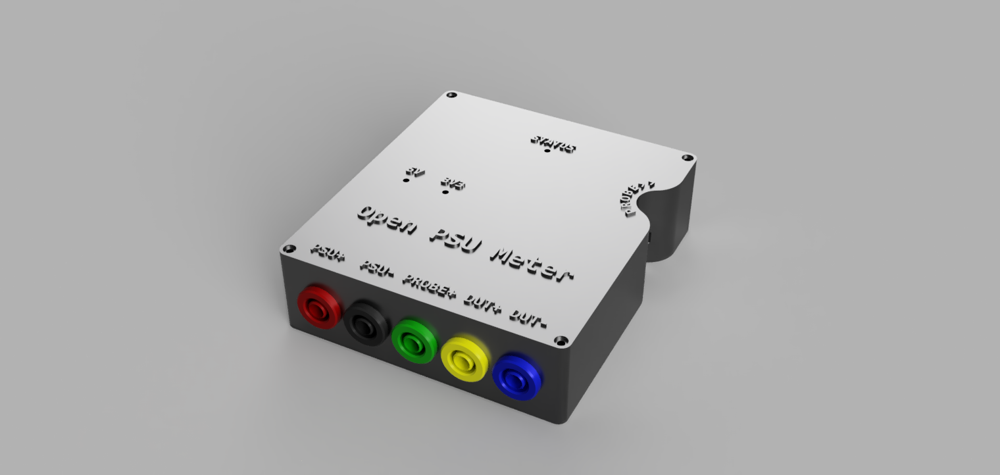
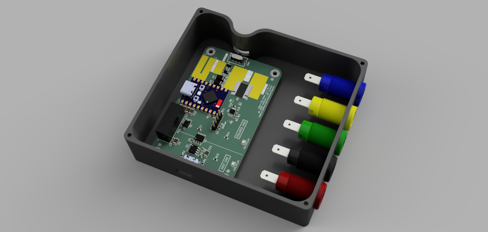
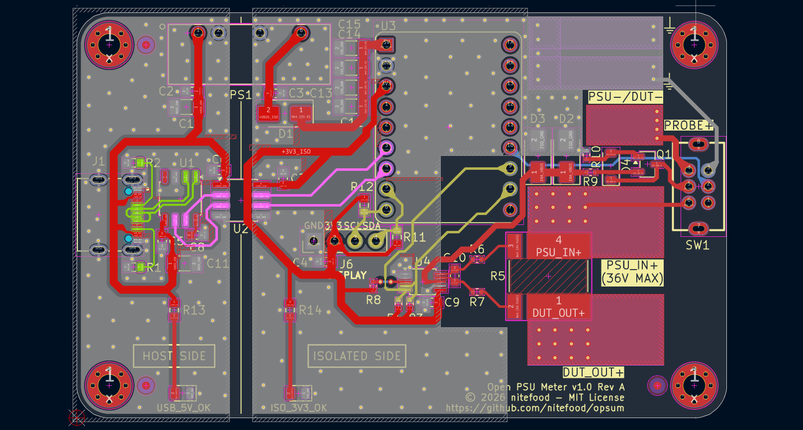
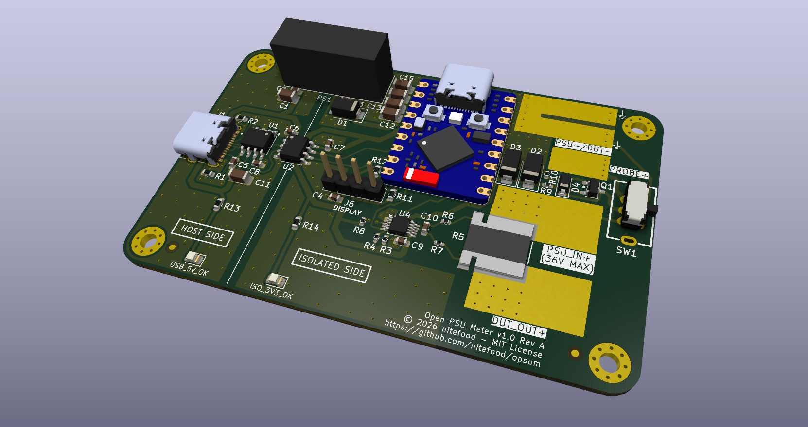
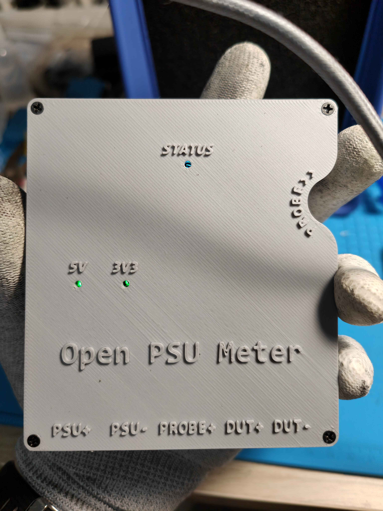
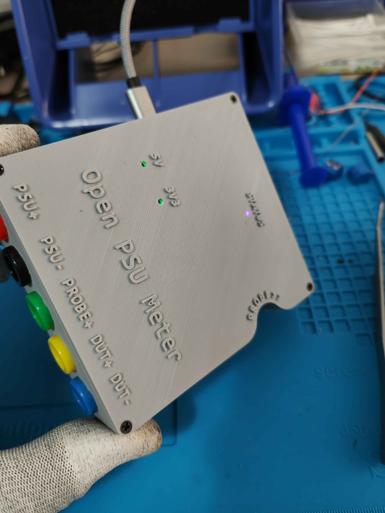
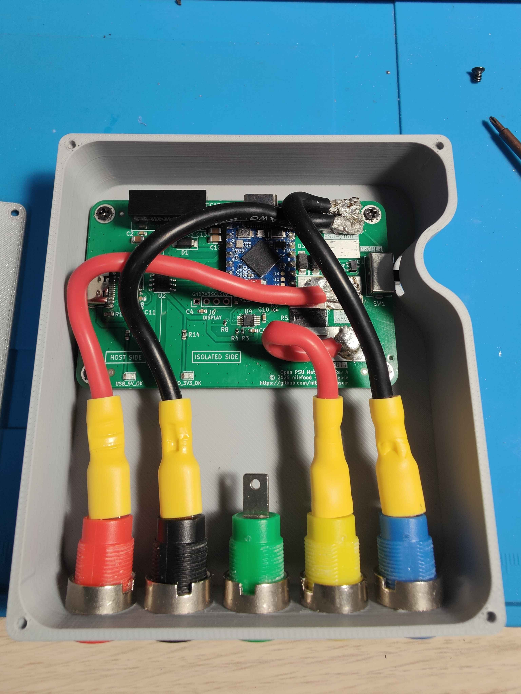
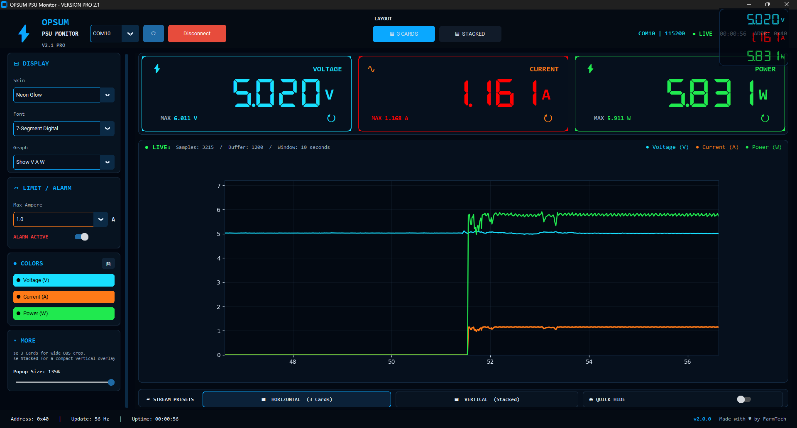

# OPSUM - The Open PSU Meter project

OPSUM is a **DC voltmeter and ammeter board** with 4mm banana socket inputs, that enables measuring and logging **voltage, current and power**, even when using a bench PSU that has no builtin telemetry feature. Communication between the board and the host happens via **UART protocol** over a dedicated USB port that is **galvanically isolated** from the PSU/DUT (*power supply unit and device under test*) side of the PCB, in order to protect the host-side (PC) from potentially destructive shorts or spikes happening on the DUT side.

This repository is structured as a **monorepo**: hardware design files, enclosure CAD files, firmware, host-side GUI tools, release binaries, communication protocol documentation, and third-party GUIs are kept together so you can build, flash, and evolve the project starting from a single source of truth.

## Features

- **Real-time voltage, current, and power monitoring** based on the [INA226](https://www.ti.com/product/INA226) monitor IC and the [ESP32-S3](https://www.espressif.com/en/products/socs/esp32-s3) SoC.
- [Kelvin-sensed](https://en.wikipedia.org/wiki/Four-terminal_sensing) shunt layout and full noise filtering (as per TI's [datasheet](https://www.ti.com/lit/ds/symlink/ina226.pdf), chapter *6.4.2 "Filtering and Input Considerations"*) for improved measurement accuracy.
- **Reverse-polarity**, **overvoltage**, and **negative-voltage** protection circuitry.
- PMOS input protection stage with zener-clamped gate drive.
- TVS + Schottky protected INA VBUS input.
- **Galvanic isolation** protecting the host-side USB port from the PSU/DUT side.
- Handles up to **36 V** bus voltage and **20 A** current.
- Compact, low-cost, fully **open source hardware, firmware and software** project.

## Images
Enclosure render (outside) | Enclosure render (inside)
| - | - |
|  |  |

PCB Layout | PCB 3D View
| - | - |
 |  |

3D printed enclosure (top view) | 3D printed enclosure (sockets visible)
| - | - |
|  |  |

#### 3D printed enclosure (internal 12AWG wiring)

#### [Farmtech's PSU monitor](/third_party_tools/farmtech/) displaying telemetry coming from a live OPSUM board

---

## Quick Start

If you want to build the project yourself, the step-by-step approach is:

1. **Manufacture the board** using a third party PCB fab house (I've used [JLCPCB](https://jlcpcb.com/?from=DUYEWB) with great results, so tolerances and specs are guaranteed to comply with their capabilities, but any fab house should be easily capable to manufacture this board). **Gerbers, BOM and CPL** files alongside required production settings and instructions for PCB manufacturing and assembly are all in the [hardware](/hardware/) section.
	> Disclaimer: the JLCPCB link above is a referral URL, I get a little kickback if you use it to subscribe or buy from them. Thanks for your support!
2. **Solder the remaining through-hole components on the PCB** using the instruction under [hardware](/hardware/). I've included a bill of material for THT and hand-assembly components required to complete the project, complete with links to AliExpress to source them.
3. **First-flash the new ESP32-S3 board** with the `-FULL` image (using `esptool`). Prebuilt binaries and usage instructions for `esptool` are in the [dist](dist/) section.
4. **3D print the enclosure and assemble the finished product**. Instructions are under [enclosure](/enclosure/).
5. **Connect the USB port to your PC and use a client-side program** to interface with the OPSUM board and receve its readings. I've included a [minimal GUI](dist/opsum_gui.exe), alongside with fully featured [third party tools](third_party_tools/) compatibile with OPSUM's core firmware [protocol](./protocol-specs/core-uart.md).

If you want to flash a different firmware, or update/reflash the core firmware in the future, there is **no need to disassemble the board** to access the native MCU USB port. Just use the **isolated USB port** with the included [flash tool](dist/flashtool.exe), and reflash the board using a `-OTA` image. OPSUM's main firmware OTA image is packaged under [dist](dist/) as well.

## Open Tooling Approach

This repository includes everything, ranging from the basic OPSUM GUI plus third-party client-side tools that support the Core firmware communication protocol, to enclosure CAD models, PCB layout design files, assembly guides and protocol specification documentation.

You are free to use whichever compatible client (or firmware) matches your needs.

## Repository Layout

| Folder | Contents |
| - | - |
| [dist/](dist/) | release binaries + compilation and flash instructions |
| [protocol-specs/](protocol-specs/) | **DFU** (flashing) and **UART** (runtime communication with the host) protocol specs |
| [src/Firmware/](src/Firmware/) | **Core** (main) and **DFU** (flash update mode) firmware source code |
| [src/GUI/](src/GUI/) | host-side GUI tools source code root folder |
| [src/GUI/flash-tool/](src/GUI/flash-tool/) | desktop DFU flashing GUI source code |
| [src/GUI/opsum-gui/](src/GUI/opsum-gui/) | minimal OPSUM runtime GUI frontend source code |
| [third_party_tools/](third_party_tools/) | bundled alternative host-side tools and board-side firmware binaries |
| [hardware/](hardware/) | schematic, PCB layout, BOM, CPL, Gerbers, manufacturing and THT component soldering step-by-step guide |
| [enclosure/](enclosure/) | CAD files and assembly instructions for the OPSUM case |

## Contributing

**OPSUM is inteded as an open, community driven project**. Anyone is welcome to contribute to it by creating or improving client-side tools, firmware, enclosure, PCB design, protocol specs or documentation!

## Acknowledgements

This project was born out of the desire to improve my PCB design skills, and to document a complete DIY approach to getting a full featured ammeter from scratch, instead of buying one.

In this endeavor, I've received a lot of precious support and ideas from the [JFIXX](https://www.youtube.com/@JFIXX1) community. If you want to join us to say hello, his [discord](https://discord.gg/TcsUshz67p) server is a welcoming and friendly place, full of very skilled and amazing techs!

## Supporting the project

If you like this project and want to support it, you can do so by clicking the button below. Thank you! <3

