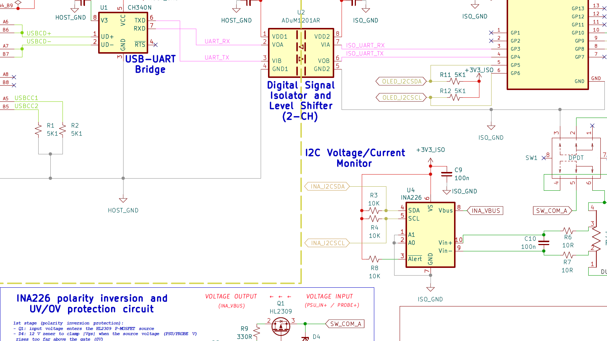

# Hardware Design Files

---

---

## Folder contents

This folder hosts electrical and manufacturing design assets for the OPSUM PCB.

## CAD software used

- The OPSUM PCB was designed entirely using the [KiCad v10.0](https://www.kicad.org/) EDA software.

- PCBs were manufactured using [JLCPCB](https://jlcpcb.com/?from=DUYEWB).

	> Disclaimer: the JLCPCB link above is a referral URL, I get a little kickback if you use it to subscribe or buy from them. Thanks for your support!
- Production files were generated by using the excellent [kicad-jlcpb-tools](https://github.com/bouni/kicad-jlcpcb-tools) KiCad plugin.

## Folder structure

| Folder/File name | Content |
| - | - |
| [schematic/](./schematic/) | Full board schematic in .PDF format|
| [KiCad/](./KiCad/) | KiCad project files for schematic and PCB layout
| [jlcpcb/](./jlcpcb/) | BOM (Bill of Materials), CPL (Component Placement List), Gerber manufacturing outputs |

## Manufacturing Guide for JLCPCB

> Coming soon

## Hand Soldering Guide for through hole components

> Coming soon
