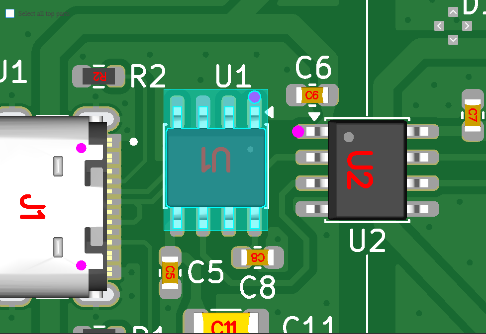
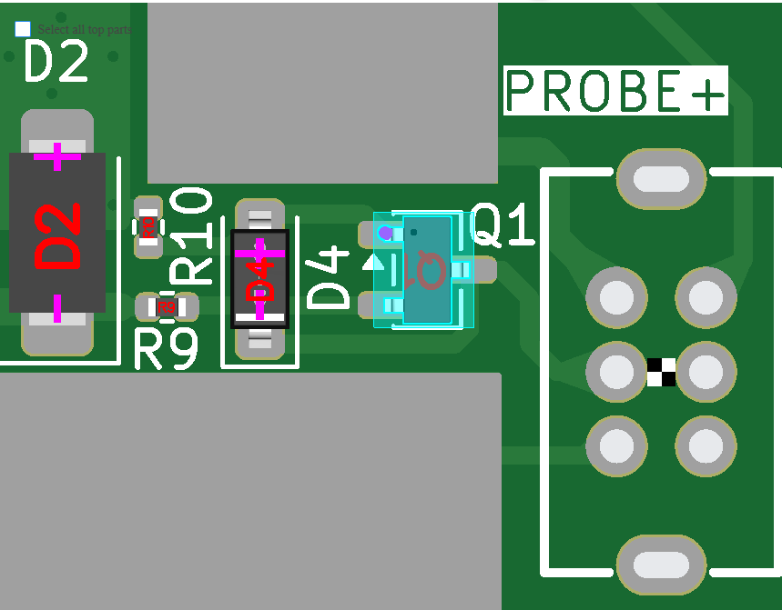

# Hardware Design Files

---

---

## Folder contents

This folder hosts electrical and manufacturing design assets for the OPSUM PCB.

## CAD software used

- The OPSUM PCB was designed entirely using the [KiCad v10.0](https://www.kicad.org/) EDA software.

- PCBs were manufactured using [JLCPCB](https://jlcpcb.com/?from=DUYEWB).

	> Disclaimer: the JLCPCB link above is a referral URL, I get a little kickback if you use it to subscribe or buy from them. Thanks for your support!
- Production files were generated by using the excellent [kicad-jlcpb-tools](https://github.com/bouni/kicad-jlcpcb-tools) KiCad plugin.

## Folder structure

| Folder/File name | Content |
| - | - |
| [schematic/](./schematic/) | Full board schematic in .PDF format |
| [KiCad/](./KiCad/) | KiCad project files for schematic and PCB layout |
| [jlcpcb/](./jlcpcb/) | BOM (Bill of Materials), CPL (Component Placement List), Gerber manufacturing outputs |

## Step-by-step Manufacturing Guide (for JLCPCB)

1. Login to [JLCPCB](https://jlcpcb.com/?from=DUYEWB) and click the **Get Instant Quote** button
2. Click "Add gerber file" and upload the [Gerber .zip archive](./jlcpcb/production_files/GERBER-Open_PSU_Meter_ESP32.zip)
3. Layers count and PCB size will be both autodetected from the Gerber files. You can leave all settings as they are. Optionally, you may prefer setting `Surface Finish` to *LeadFree HASL*, but the default will do just fine
4. Scroll to the bottom of the page and enable the **PCB Assembly** toggle. Keep the default values there as well
5. Ensure you pick the desired **PCBA Qty** value: this will determine how many of the manufactured PCBs will also get their SMT components assembled
6. Click Next, then Next.
7. Add the [BOM](./jlcpcb/production_files/BOM-Open_PSU_Meter_ESP32.csv) and [CPL](./jlcpcb/production_files/CPL-Open_PSU_Meter_ESP32.csv) files, then click  **Process BOM & CPL**
8. Ignore the warning (*"The below parts won't be assembled due to data missing.
U3,PS1 designators don't exist in the BOM file."*). This is intentional, since those parts (ESP32-S3-Zero breakout board and isolated DC/DC converter) are to be sourced externally and hand soldered on the PCB. More on that [below](#hand-soldering-guide-for-through-hole-components).
9. Review the matched parts and ensure all are in stock. Click Next.
10. **Carefully check part orientation on the board**. Sometimes their automated system fails to correctly orient the components on the pads. In my case, I had to re-orient **U1** and **Q1**. Just **click the component to select it**, and **press the space key** until they're in the correct orientation (the purple dot should align with the white silkscreen dot/arrow). They should look like this:

	| U1 | Q1 |
	| - | - |
	|  |  |
11. Click Next and pick "*Research/Education/DIY/Entertainment*" -> "*DIY Hobby Circuit Board - HS Code 902300*" from the product description dropdown, then click **Save to Cart**
12. Select the cart item (PCB Manufacture + PCBA) and proceed to Secure Checkout. You will be able to pick a shipping method, enter your shipping address, and complete the order.

## Hand Soldering Guide for through hole components

> Coming soon
